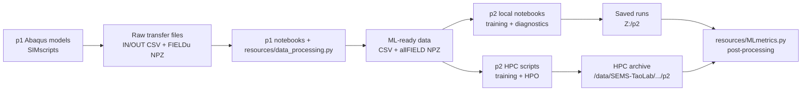

# Niccolo Forte's PhD Repository

This repository contains the scripts, notebooks, and shared Python helpers used throughout my PhD work on disordered lattice materials. It is organized by paper/project folder, with a shared top-level `resources` package that carries the reusable mechanics, Abaqus post-processing, data-processing, machine-learning, and diagnostics code.

At a high level:

- `p1-DisorderLatticeProperties/` generates and post-processes Abaqus finite-element simulations of quasi-disordered 2D lattices.
- `p2-DisorderML/` trains and diagnoses machine-learning surrogate models that map lattice disorder to mechanical response.
- `p3-DisorderIcingMitigation/` contains early Abaqus simulation work for disorder-enabled ice-mitigation concepts.
- `resources/` is the shared package that connects the paper folders.

## Quick Start

From the repository root, run:

```powershell
.\setup-Windows.ps1
```

On macOS, run:

```bash
./setup-macOS.sh
```

The Windows script sets up the shared `resources` package for both standard Python and Abaqus Python. The macOS script creates or refreshes the isolated `nf-phd` Conda environment for standard Python; Abaqus is not available on macOS. Both scripts verify imports from outside the repo root. After setup, code can use imports such as:

```python
from resources.MLdata import DATA
from resources.lattices import Geometry
from resources.data_processing import create_inputCSV, create_outputCSV
```

On Windows, `-OnlyPython` and `-OnlyAbaqus` select one interpreter. Pass `-remove` to either platform script to reverse its setup.

The root `requirements.txt` is set up for a standard local Python environment, including CPU PyTorch wheels. The GPU/HPC machine-learning environment is managed separately by `p2-DisorderML/HPC/B0_ML-env-setup.sh`.

## Agent Guidance And Repo Skills

Repository guidance is tracked with the code so a fresh checkout carries the same working agreements:

- Start with the root `AGENTS.md`, then read the closest nested `AGENTS.md` before working in a paper folder, notebook folder, HPC folder, or `resources/`.
- The root and nested `AGENTS.md` files provide the minimum repository and local context. Agents should additionally consult the relevant README sections for unfamiliar or cross-project work and for setup, navigation, commands, workflows, interpretation, or maintenance; repository-wide or unclear-scope work requires the full README.
- Project-specific guidance includes `p1-DisorderLatticeProperties/AGENTS.md`, `p2-DisorderML/AGENTS.md`, `p3-DisorderIcingMitigation/AGENTS.md`, and `resources/AGENTS.md`.
- Each paper has a concise `PROJECT_STATUS.md` for continuation, planning, and handoff. It holds only changing objectives, current evidence, decisions, external requirements, and the next task; durable rules stay in `AGENTS.md`.
- Repo-scoped skills live under `.agents/skills/`. `maintain-repo-guidance` keeps instructions synchronized, `validate-repo-change` selects proportionate checks, `review-p1-p2-data-contract` protects the FEA-to-ML producer-consumer boundary, and `operate-p2-hpc` loads cluster procedures only for relevant work.
- Human-facing setup, structure, commands, workflows, and limitations belong in this README and must stay current whenever those facts change. Agent-specific routing, safety, and validation rules belong in the closest relevant `AGENTS.md`. Reusable procedures belong in a skill.
- Current guidance should be edited in place; Git history records the chronology.

Before completing a change, run:

```powershell
python .agents/skills/validate-repo-change/scripts/validate_repo.py --changed
```

Useful broader scopes are `--scope resources`, `--scope p1`, `--scope p2`, `--scope p3`, `--scope contract`, and `--scope all`. The validator:

- runs `git diff --check` and the guidance-integrity checker, which reports every effective `AGENTS.md` chain, warns above 24 KiB, and fails above 32 KiB;
- compiles selected Python without executing it and labels Abaqus-dependent code `SYNTAX-ONLY`;
- imports applicable `resources` modules in fresh Python processes;
- checks notebook JSON/required structure, `bash -n`, and PowerShell parsing when those interpreters are available;
- checks the explicitly non-scientific contract fixture for aligned sample ids, periodic id `0`, field shapes/metadata, and CSV/NPZ serialization;
- reports Abaqus, Slurm/HPC, external `Z:` data, saved-run, and scientific execution as `SKIP` when they were not exercised.

The synthetic fixture contains only minimal identities and shapes, not experimental or simulated research values. It detects structural breakage; it cannot establish scientific correctness. The `.github/workflows/guidance-integrity.yml` workflow runs the changed-surface validator on pushes and pull requests. Local validation remains required; availability of GitHub Actions on the QMUL server is `To be confirmed` until a remote run is observed.

The `review-p1-p2-data-contract` skill treats the boundary like an internal API: p1 writes named, indexed CSV/NPZ products; shared resources transform/load them; p2 assumes the same identity, shape, metadata, and saved-run layout. Use it when a change could make one stage produce data that another stage misreads even though both stages still run.

`update-repo.ps1` is a legacy manual multi-checkout workflow, not a setup or validation command. It runs pulls, broad staging, commits, pushes, and an SSH login against hard-coded local, OneDrive, `Z:`, and QMUL HPC locations. Do not run it without explicitly reviewing and confirming every target; whether it should be retired or redesigned is `Decision required`.

## Git Remotes And Dual Push

The intended setup fetches from QMUL GitHub while a single `git push` publishes the current branch to both QMUL GitHub and the public GitHub.com mirror. Configure each fresh clone once because push URLs live in that clone's local `.git/config` and are not versioned:

```powershell
git remote set-url origin https://github.qmul.ac.uk/exy053/NF-PhD-gitRepo.git
git config --unset-all remote.origin.pushurl
git config --add remote.origin.pushurl https://github.qmul.ac.uk/exy053/NF-PhD-gitRepo.git
git config --add remote.origin.pushurl https://github.com/niccoforte/NF-PhD-gitRepo.git
git remote -v
```

After that, ordinary `git pull`/`git fetch` use the single QMUL fetch URL, while `git push` or `git push origin main` pushes to both configured destinations. Authentication must work for both servers.

A multi-destination push is not atomic: one server can accept a commit before the other rejects it or becomes unavailable. If `git push` reports any failure, compare both remote branch tips before retrying:

```powershell
git ls-remote https://github.qmul.ac.uk/exy053/NF-PhD-gitRepo.git refs/heads/main
git ls-remote https://github.com/niccoforte/NF-PhD-gitRepo.git refs/heads/main
```

Do not set these `origin` push URLs globally, because that would affect unrelated repositories that also call their remote `origin`.

## Repository Map

```text
00-PhD-gitRepo/
+-- AGENTS.md
+-- README.md
+-- .agents/
|   +-- skills/
|       +-- maintain-repo-guidance/
|       +-- operate-p2-hpc/
|       +-- review-p1-p2-data-contract/
|       +-- validate-repo-change/
|           +-- scripts/
|           |   +-- validate_repo.py
|           +-- fixtures/
|               +-- synthetic_contract/
|                   +-- contract.json
+-- .github/
|   +-- workflows/
|       +-- guidance-integrity.yml
+-- pyproject.toml
+-- requirements.txt
+-- requirements-abaqus.txt
+-- setup-Windows.ps1
+-- setup-macOS.sh
+-- update-repo.ps1
+-- p1-DisorderLatticeProperties/
|   +-- AGENTS.md
|   +-- PROJECT_STATUS.md
|   +-- code/
|   |   +-- AGENTS.md
|   |   +-- DataProcessing.ipynb
|   |   +-- InputsOutputs.ipynb
|   |   +-- SIMresults.ipynb
|   |   +-- StiffnessMatrix.ipynb
|   |   +-- ContinuumPlots.ipynb
|   |   +-- ValConvPlots.ipynb
|   |   +-- AK-*.ipynb and exploratory notebooks
|   +-- SIMscripts/
|       +-- AGENTS.md
|       +-- A1_FractureToughness-Ductility.py
|       +-- A2_INpostProcess.py
|       +-- A2_OUTpostProcess.py
|       +-- A2_FieldOUTpostProcess.py
|       +-- A3_ContinuumPP.py
|       +-- B1_ABAQUS-new.sh
|       +-- B1_ABAQUS-inp-rerun.sh
|       +-- B2_ABAQUS-PPscratch-new.sh
|       +-- B3_ABAQUS-transfer.sh
|       +-- run-local.ps1
|       +-- odbUpgrade.py
|       +-- OldScriptVersions/
+-- p2-DisorderML/
|   +-- AGENTS.md
|   +-- PROJECT_STATUS.md
|   +-- code/
|   |   +-- AGENTS.md
|   |   +-- ML-CurveOutputs.ipynb
|   |   +-- ML-FieldOutputs.ipynb
|   |   +-- ML-FieldToCurveOutputs.ipynb
|   |   +-- ML-CurvePostProcessing.ipynb
|   |   +-- ML-FieldPostProcessing.ipynb
|   |   +-- ML-HPOpostProcess.ipynb
|   |   +-- Tokenization.ipynb
|   |   +-- TOKENIZATION_NEXT_STEPS.md
|   |   +-- exploratory/prototype notebooks
|   +-- HPC/
|       +-- AGENTS.md
|       +-- B0_ML-env-setup.sh
|       +-- B1_ML-new.sh
|       +-- B2_ML-resumeHPO.sh
|       +-- B3_ML-transfer.sh
|       +-- CurveOutputs/
|       +-- FieldOutputs/
|       +-- FieldToCurve/
+-- p3-DisorderIcingMitigation/
|   +-- AGENTS.md
|   +-- PROJECT_STATUS.md
|   +-- SIMscripts/
|       +-- A1_IcingModels.py
+-- resources/
    +-- AGENTS.md
    +-- abaqus.py
    +-- calculations.py
    +-- data_processing.py
    +-- lattices.py
    +-- MLdata.py
    +-- MLfunc.py
    +-- MLmetrics.py
    +-- MLmodels.py
    +-- tokenization.py
    +-- utilities.py
```

GitHub can render the workflow diagram below as a Mermaid chart:



## Research Vocabulary

The same terms appear across Abaqus scripts, data-processing notebooks, and ML code:

- `Ductile` or `UT`: uniaxial/ductile branch, usually stress-strain response. Derived properties include ductility, strength, stiffness, and work of fracture.
- `Fracture` or `FT`: compact-tension/fracture branch, usually force-displacement response. Derived properties include force/displacement at fracture and toughness metrics such as `K_IC` and `K_JIC`.
- `MULTI` or `both`: aligned UT and FT samples used together.
- `per`: periodic/reference lattice case. In processed data this is treated as simulation id `0`.
- `disNodes`: nodal disorder.
- `disStruts`: strut-thickness disorder.
- `FIELDu`: displacement field-output data exported from Abaqus ODBs.

## Paper 1: Disorder Lattice Properties

`p1-DisorderLatticeProperties/` is the finite-element and data-generation layer. It creates quasi-disordered 2D lattice simulations, extracts input/output data from Abaqus files, and prepares the mechanical data used later by p2.

### `p1-DisorderLatticeProperties/SIMscripts/`

This folder contains the active local and HPC Abaqus workflow.

| File | Role |
| --- | --- |
| `A1_FractureToughness-Ductility.py` | Main Abaqus CAE model generator for ductile/uniaxial and fracture/compact-tension simulations. Handles lattice geometry, nodal/strut disorder, material laws, boundary conditions, output requests, and job writing/submission. |
| `A2_INpostProcess.py` | Parses `.inp` files and exports input-side transfer CSVs for node positions, strut thicknesses, and frequency-disorder parameters. |
| `A2_OUTpostProcess.py` | Parses `.odb` history outputs and writes curve-side `OUT-Ductile...csv` and `OUT-Fracture...csv` files. |
| `A2_FieldOUTpostProcess.py` | Parses `.odb` field outputs and writes per-simulation `FIELDu-...npz` files with displacement fields, node labels, coordinates, frames, components, masks, and source metadata. |
| `A3_ContinuumPP.py` | Older continuum-style displacement post-processing helper for `frame*.csv` and `NodesElems.csv` outputs. |
| `B1_ABAQUS-new.sh` | Main Slurm wrapper. Stages scripts and `resources/` to scratch, runs Abaqus generation/post-processing, and archives outputs. |
| `B1_ABAQUS-inp-rerun.sh` | Runs existing `.inp` files and can post-process them in place. |
| `B2_ABAQUS-PPscratch-new.sh` | Re-runs post-processing over archived simulation directories. |
| `B3_ABAQUS-transfer.sh` | Transfers `transfer/` files and archives between QMUL HPC and local `Z:/p1/data/Ti`. |
| `run-local.ps1` | Local Windows launcher for Abaqus testing. |
| `odbUpgrade.py` | ODB upgrade helper. It can delete old ODBs depending on configuration, so treat it carefully. |

The active A1/A2 Abaqus scripts share a positional command contract after `--`:

```text
LAT nnx unitCellSize mode material rD DIS fac distribution target initial nJobs CPUs Fout Hout pDir
```

`OldScriptVersions/` contains historical Abaqus, UGE, and Akash-origin scripts. These are useful for provenance but should not be treated as the active workflow unless explicitly needed.

### `p1-DisorderLatticeProperties/code/`

This folder contains notebooks for data conversion, mechanics inspection, validation, and exploratory analysis.

| Notebook | Role |
| --- | --- |
| `DataProcessing.ipynb` | Current batch conversion notebook. It builds `DATA(path=1, ...)` objects and calls `create_inputCSV`, `create_outputCSV`, and `create_fieldNPZ`. |
| `InputsOutputs.ipynb` | Inspects and saves ML-ready curve and field data using `load_data`, `UTprops`, `FTprops`, `MULTIprops`, `save_MLdata`, `save_MULTIdata`, `save_field_MLdata`, and `save_MULTIfieldData`. |
| `SIMresults.ipynb` | Quick local/transfer result inspection and property calculation from output CSVs. |
| `StiffnessMatrix.ipynb` | Stiffness matrix, isotropy, anisotropy, and effective-property calculations. |
| `ContinuumPlots.ipynb` | Displacement/continuum-style visualization using frame CSVs and lattice connectivity. |
| `ValConvPlots.ipynb` | Material model, convergence, validation, and mechanics plots. |
| `AK-DataProcessing.ipynb`, `AK-InputsOutputs.ipynb` | Legacy Akash-data workflows using `DATA(path=0, ...)`. |
| `FunctionApproximation.ipynb`, `Sampling.ipynb`, `QuickPlots..ipynb` | Exploratory research notebooks. |

Current local Ti data usually resolves through:

```python
DATA(path=1, LAT="FCC", nnx=20, dis="disNodes", dN=0.2, mechMode="UT")
```

The path resolver maps that style of call into local `Z:/p1/data/Ti/...` folders and uses `PATH_PER` for periodic/reference data.

## Paper 2: Disorder ML

`p2-DisorderML/` is the machine-learning and optimization layer. It consumes ML-ready p1 data and trains surrogate models for macroscopic curves and nodal displacement fields.

### `p2-DisorderML/code/`

This folder is the local notebook workspace for model development and post-processing.

| Notebook/File | Role |
| --- | --- |
| `ML-CurveOutputs.ipynb` | Main local curve-output training/HPO notebook for MLP, GCN/GAT/GNN, and Transformer models. |
| `ML-FieldOutputs.ipynb` | Main local field-output training/HPO notebook for node-compatible models such as GCN/GAT/GNN and Transformer. |
| `ML-FieldToCurveOutputs.ipynb` | Exploratory field-input to curve-output notebook aligned with the HPC field-to-curve framework. |
| `ML-CurvePostProcessing.ipynb` | Diagnostics for one saved curve run. |
| `ML-FieldPostProcessing.ipynb` | Diagnostics and visualization for one saved field run. |
| `ML-HPOpostProcess.ipynb` | HPO study comparison and best-run inspection. |
| `Tokenization.ipynb` | Output-informed tokenization prototype for recurring disorder motifs. |
| `TOKENIZATION_NEXT_STEPS.md` | Current planning notes for the tokenization workflow. |
| `DimensionalityReduction.ipynb`, `GPR.ipynb`, `ML-DisorderDistribution.ipynb`, `Optimization.ipynb`, `AK-ML-StressStrain.ipynb` | Exploratory/prototype notebooks and research history. |

Curve-output models predict macroscopic stress-strain or force-displacement curves. Field-output models predict per-node displacement fields over Abaqus frames. Field data is normally stored as final ML-ready `allFIELD.npz` products after raw `FIELDu-...npz` files have been stacked and saved.

### `p2-DisorderML/HPC/`

This folder contains the QMUL HPC/Slurm training and HPO workflow.

| File/Folder | Role |
| --- | --- |
| `B0_ML-env-setup.sh` | Creates or refreshes the `nf-ml-gpu` conda environment with CUDA PyTorch, PyTorch Geometric, Optuna, BoTorch/GPyTorch, and related ML dependencies. |
| `B1_ML-new.sh` | Main Slurm submit wrapper. Copies the selected run script and `resources/` to scratch, runs training/HPO, and rsyncs outputs to the archive root. |
| `B2_ML-resumeHPO.sh` | Resumes archived cross-model Optuna studies and supports a non-running `--dry-run` plan check. |
| `B3_ML-transfer.sh` | Transfers saved p2 run folders from HPC archives to local `Z:/p2` or fallback local folders. |
| `CurveOutputs/A0-HPC_Curve-test.py` | Production-oriented single-run curve entry point; reduced debug runs require explicit CLI overrides. |
| `CurveOutputs/A0-HPC_Curve-CrossModelHPO.py` | Cross-model HPO entry point for curve surrogates. |
| `FieldOutputs/A0-HPC_Field-test.py` | Production-oriented single-run field entry point; reduced debug runs require explicit CLI overrides. |
| `FieldOutputs/A0-HPC_Field-CrossModelHPO.py` | Cross-model HPO entry point for field surrogates. |
| `FieldToCurve/A0-HPC_FieldToCurve-test.py` | Production-oriented Transformer single-run entry point for field-input to curve-output models. |
| `FieldToCurve/A0-HPC_FieldToCurve-CrossModelHPO.py` | Cross-model HPO entry point for field-to-curve surrogates. |

Important HPC conventions:

- `DATA_ROOT` should point to the parent folder containing `MLdata`, not directly to the `MLdata` folder.
- `ML_RUN_ROOT` points to scratch during a job.
- `ML_ARCHIVE_ROOT` records the archive target in saved metadata.
- `ML_RUN_CONTEXT=HPC` records cluster context but must not alter run descriptors or study names.
- Production GPU jobs should fail clearly if CUDA is unavailable; `--allow-cpu` is for local/debug use.

## Paper 3: Disorder Icing Mitigation

`p3-DisorderIcingMitigation/` currently contains provisional Abaqus work intended for a future ice-mitigation study:

```text
p3-DisorderIcingMitigation/
+-- AGENTS.md
+-- PROJECT_STATUS.md
+-- SIMscripts/
    +-- A1_IcingModels.py
```

This area is less settled than p1 and p2. The current file is a large Abaqus lattice model with inline geometry, disorder, material, ductile, and fracture logic. The repository does not yet establish a validated icing-interface, adhesion, thermal, cohesive, or de-icing model. Its scientific scope, validation target, and authoritative workflow are `To be confirmed`; read the local `AGENTS.md` and do not infer them from p1.

## Shared Package: `resources/`

`resources/` is installed as the local package `phd-shared-resources` and is used across the paper folders.

| Module | What it owns |
| --- | --- |
| `abaqus.py` | Abaqus-facing node generation, disorder sampling, `.inp` exports, ODB history parsing, ODB field parsing, and older continuum exports. |
| `calculations.py` | Curve smoothing/parsing, UT/FT property calculations, fracture geometry factors, and a legacy Abaqus optimization hook. |
| `data_processing.py` | Conversion from raw p1 `transfer/` files into processed input/output CSVs, manifests, field indexes, and stacked field NPZ files. |
| `lattices.py` | `Geometry`, lattice dimensions, relative-density thicknesses, node counts, connectivity, effective properties, stiffness matrices, isotropy, and anisotropy helpers. |
| `MLdata.py` | `DATA`, path resolution, ML-ready loading, split construction, scaling, dimensionality reduction, node filtering, field loading, and MLdata saving. |
| `MLfunc.py` | Training loops, loss functions, HPO helpers, activation diagnostics, and older ML plotting helpers. |
| `MLmetrics.py` | Saved-run loading, curve/field diagnostics, plotting, HPO summaries, and post-processing helpers. |
| `MLmodels.py` | Model classes, `MODEL`, dataloaders, train/predict/evaluate orchestration, checkpoint metadata, saved-run layout, and result artifact writing. |
| `tokenization.py` | Output-informed tokenization prototype for recurring disorder motifs. |
| `utilities.py` | File renaming, Abaqus `.inp` editing, and backup deletion helpers. Use cautiously on real data folders. |
| `imports.py` | Convenience import bundle used by older notebooks. Prefer explicit imports in new code. |

## Data And Artifact Conventions

Common local paths:

- p1 local data: `Z:/p1/data/Ti/...`
- p2 local saved runs: `Z:/p2`
- p1 HPC archive: `/data/SEMS-TaoLab/Niccolo-Forte/p1/Ti/data`
- p2 HPC archive: `/data/SEMS-TaoLab/Niccolo-Forte/p2`

Important file families:

- `IN-n...csv`: input node coordinates.
- `IN-s...csv`: input strut thicknesses.
- `IN-f...csv`: frequency-disorder parameters.
- `OUT-Ductile...csv`: uniaxial/ductile curve outputs.
- `OUT-Fracture...csv`: compact-tension/fracture curve outputs.
- `FIELDu-...npz`: raw per-simulation displacement field output from Abaqus.
- `Ductile-{dis}-FIELDu.npz` and `Fracture-{dis}-FIELDu.npz`: stacked p1 field outputs.
- `*-allIN.csv`, `*-allINf.csv`, `*-allOUT.csv`, `*-allProps.csv`, and `*-allFIELD.npz`: ML-ready p2-facing products.

Generated data, Abaqus artifacts, model checkpoints, HPO databases, Slurm logs, and notebook output bulk are research artifacts. Do not delete, rename, or commit them unless intentionally doing data/archive maintenance.

## Setup (Python + Abaqus)

Recommended setup from the repository root:

```powershell
.\setup-Windows.ps1
```

```bash
./setup-macOS.sh
```

On Windows, this installs for both interpreters:

- all dependencies from `requirements.txt` into standard Python
- all dependencies from `requirements-abaqus.txt` into Abaqus Python
- the local repo package (`resources`) for standard Python
- the local repo package (`resources`) for Abaqus Python

On macOS, the script creates or refreshes the `nf-phd` Conda environment, installs the standard-Python dependencies with macOS-compatible PyTorch and TensorFlow versions, and installs the local `resources` package. It does not attempt to install Abaqus.

The macOS script expects Miniforge at `~/miniforge3` by default. Set `CONDA_ROOT` to another installation, `CONDA_ENV` to choose another environment name, or `PYTHON_VERSION` to override Python 3.12 before running it. Its dependency list intentionally mirrors the standard requirements while replacing Windows/Linux-specific PyTorch and TensorFlow pins; dependency changes must review both `requirements.txt` and `setup-macOS.sh`.

Important implementation details:

- setup writes a `.pth` hook (`phd_shared_resources_repo.pth`) in Abaqus user site-packages for reliability and to cover local-package pip failures
- setup verifies imports from a temp directory, not from the repo root, so import checks are real
- if `PIP_NO_INDEX` is set in the shell, setup temporarily unsets it during install and restores it afterwards
- setup and removal change external environments; repository validation parses these scripts but does not execute installation or removal automatically

Optional flags:

- `.\setup-Windows.ps1 -OnlyPython` runs only standard Python setup
- `.\setup-Windows.ps1 -OnlyAbaqus` runs only Abaqus Python setup

## Remove Setup

To uninstall everything installed by setup for both interpreters, run:

```powershell
.\setup-Windows.ps1 -remove
```

```bash
./setup-macOS.sh -remove
```

Windows removal behavior:

- standard Python: uninstall local `resources` package and uninstall all packages listed in `requirements.txt`
- Abaqus Python: uninstall local `resources` package and uninstall all packages listed in `requirements-abaqus.txt`
- remove fallback `.pth` hooks (`phd_shared_resources_repo.pth`) for both Python and Abaqus if present

On macOS, removal deletes the isolated `nf-phd` Conda environment. It does not delete the repository, Miniforge, or packages in other Python environments.

Important:

- keep only packages you want removable in `requirements-abaqus.txt`; currently this is `pandas`
- verification at the end checks whether `resources` can still be discovered outside repo-root path injection

Optional flags:

- `.\setup-Windows.ps1 -remove -OnlyPython` runs only standard Python removal
- `.\setup-Windows.ps1 -remove -OnlyAbaqus` runs only Abaqus removal
- `.\setup-Windows.ps1 -remove -SkipPythonRequirementsUninstall` removes the local `resources` package/hook but keeps packages from `requirements.txt` and `requirements-abaqus.txt` installed
- `./setup-macOS.sh -remove` removes the isolated `nf-phd` Conda environment and leaves the repository untouched

## Working Notes

- Standard Python and Abaqus Python are separate environments. Code that touches `mdb`, `session`, `openOdb`, or Abaqus constants needs Abaqus Python for real execution.
- `python .agents/skills/validate-repo-change/scripts/validate_repo.py --changed` labels compiled Abaqus-dependent Python as `SYNTAX-ONLY`; it does not validate Abaqus API behavior.
- `AGENTS.md` files and `.agents/skills/` are tracked repository infrastructure and must stay current with the code and this README.
- `.gitignore` excludes standard Abaqus replay/session files by their specific names without hiding the tracked `resources/abaqus.py` source module from normal file discovery.
- `phd_shared_resources.egg-info/` can be created by editable installs and is expected.
- pip warnings such as `Ignoring invalid distribution -ygments/-ympy` come from existing broken metadata in the Python environment, not from this repository.
