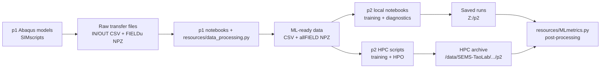

# Niccolo Forte's PhD Repository

This repository contains the scripts, notebooks, and shared Python helpers used throughout my PhD work on disordered lattice materials. It is organized by paper/project folder, with a shared top-level `resources` package that carries the reusable mechanics, Abaqus post-processing, data-processing, machine-learning, and diagnostics code.

At a high level:

- `p1-DisorderLatticeProperties/` generates and post-processes Abaqus finite-element simulations of quasi-disordered 2D lattices.
- `p2-DisorderML/` trains and diagnoses machine-learning surrogate models that map lattice disorder to mechanical response.
- `p3-DisorderIcingMitigation/` contains early Abaqus simulation work for disorder-enabled ice-mitigation concepts.
- `resources/` is the shared package that connects the paper folders.

## Quick Start

From the repository root, run:

```powershell
.\setup.ps1
```

That sets up the shared `resources` package for both standard Python and Abaqus Python, then verifies imports from outside the repo root. After setup, code can use imports such as:

```python
from resources.MLdata import DATA
from resources.lattices import Geometry
from resources.data_processing import create_inputCSV, create_outputCSV
```

If you are only working with notebooks or standard Python tools, `.\setup.ps1 -OnlyPython` is usually enough. If you are only preparing Abaqus-side helpers, use `.\setup.ps1 -OnlyAbaqus`.

The root `requirements.txt` is set up for a standard local Python environment, including CPU PyTorch wheels. The GPU/HPC machine-learning environment is managed separately by `p2-DisorderML/HPC/B0_ML-env-setup.sh`.

## Repository Map

```text
00-PhD-gitRepo/
+-- README.md
+-- pyproject.toml
+-- requirements.txt
+-- requirements-abaqus.txt
+-- setup.ps1
+-- remove-setup.ps1
+-- update-repo.ps1
+-- p1-DisorderLatticeProperties/
|   +-- code/
|   |   +-- DataProcessing.ipynb
|   |   +-- InputsOutputs.ipynb
|   |   +-- SIMresults.ipynb
|   |   +-- StiffnessMatrix.ipynb
|   |   +-- ContinuumPlots.ipynb
|   |   +-- ValConvPlots.ipynb
|   |   +-- AK-*.ipynb and exploratory notebooks
|   +-- SIMscripts/
|       +-- A1_FractureToughness-Ductility.py
|       +-- A2_INpostProcess.py
|       +-- A2_OUTpostProcess.py
|       +-- A2_FieldOUTpostProcess.py
|       +-- A3_ContinuumPP.py
|       +-- B1_ABAQUS-new.sh
|       +-- B1_ABAQUS-inp-rerun.sh
|       +-- B2_ABAQUS-PPscratch-new.sh
|       +-- B3_ABAQUS-transfer.sh
|       +-- run-local.ps1
|       +-- odbUpgrade.py
|       +-- OldScriptVersions/
+-- p2-DisorderML/
|   +-- code/
|   |   +-- ML-CurveOutputs.ipynb
|   |   +-- ML-FieldOutputs.ipynb
|   |   +-- ML-FieldToCurveOutputs.ipynb
|   |   +-- ML-CurvePostProcessing.ipynb
|   |   +-- ML-FieldPostProcessing.ipynb
|   |   +-- ML-HPOpostProcess.ipynb
|   |   +-- Tokenization.ipynb
|   |   +-- TOKENIZATION_NEXT_STEPS.md
|   |   +-- exploratory/prototype notebooks
|   +-- HPC/
|       +-- B0_ML-env-setup.sh
|       +-- B1_ML-new.sh
|       +-- B3_ML-transfer.sh
|       +-- CurveOutputs/
|       +-- FieldOutputs/
|       +-- FieldToCurve/
+-- p3-DisorderIcingMitigation/
|   +-- SIMscripts/
|       +-- A1_IcingModels.py
+-- resources/
    +-- abaqus.py
    +-- calculations.py
    +-- data_processing.py
    +-- lattices.py
    +-- MLdata.py
    +-- MLfunc.py
    +-- MLmetrics.py
    +-- MLmodels.py
    +-- tokenization.py
    +-- utilities.py
```

GitHub can render the workflow diagram below as a Mermaid chart:



## Research Vocabulary

The same terms appear across Abaqus scripts, data-processing notebooks, and ML code:

- `Ductile` or `UT`: uniaxial/ductile branch, usually stress-strain response. Derived properties include ductility, strength, stiffness, and work of fracture.
- `Fracture` or `FT`: compact-tension/fracture branch, usually force-displacement response. Derived properties include force/displacement at fracture and toughness metrics such as `K_IC` and `K_JIC`.
- `MULTI` or `both`: aligned UT and FT samples used together.
- `per`: periodic/reference lattice case. In processed data this is treated as simulation id `0`.
- `disNodes`: nodal disorder.
- `disStruts`: strut-thickness disorder.
- `FIELDu`: displacement field-output data exported from Abaqus ODBs.

## Paper 1: Disorder Lattice Properties

`p1-DisorderLatticeProperties/` is the finite-element and data-generation layer. It creates quasi-disordered 2D lattice simulations, extracts input/output data from Abaqus files, and prepares the mechanical data used later by p2.

### `p1-DisorderLatticeProperties/SIMscripts/`

This folder contains the active local and HPC Abaqus workflow.

| File | Role |
| --- | --- |
| `A1_FractureToughness-Ductility.py` | Main Abaqus CAE model generator for ductile/uniaxial and fracture/compact-tension simulations. Handles lattice geometry, nodal/strut disorder, material laws, boundary conditions, output requests, and job writing/submission. |
| `A2_INpostProcess.py` | Parses `.inp` files and exports input-side transfer CSVs for node positions, strut thicknesses, and frequency-disorder parameters. |
| `A2_OUTpostProcess.py` | Parses `.odb` history outputs and writes curve-side `OUT-Ductile...csv` and `OUT-Fracture...csv` files. |
| `A2_FieldOUTpostProcess.py` | Parses `.odb` field outputs and writes per-simulation `FIELDu-...npz` files with displacement fields, node labels, coordinates, frames, components, masks, and source metadata. |
| `A3_ContinuumPP.py` | Older continuum-style displacement post-processing helper for `frame*.csv` and `NodesElems.csv` outputs. |
| `B1_ABAQUS-new.sh` | Main Slurm wrapper. Stages scripts and `resources/` to scratch, runs Abaqus generation/post-processing, and archives outputs. |
| `B1_ABAQUS-inp-rerun.sh` | Runs existing `.inp` files and can post-process them in place. |
| `B2_ABAQUS-PPscratch-new.sh` | Re-runs post-processing over archived simulation directories. |
| `B3_ABAQUS-transfer.sh` | Transfers `transfer/` files and archives between QMUL HPC and local `Z:/p1/data/Ti`. |
| `run-local.ps1` | Local Windows launcher for Abaqus testing. |
| `odbUpgrade.py` | ODB upgrade helper. It can delete old ODBs depending on configuration, so treat it carefully. |

The active A1/A2 Abaqus scripts share a positional command contract after `--`:

```text
LAT nnx unitCellSize mode material rD DIS fac distribution target initial nJobs CPUs Fout Hout pDir
```

`OldScriptVersions/` contains historical Abaqus, UGE, and Akash-origin scripts. These are useful for provenance but should not be treated as the active workflow unless explicitly needed.

### `p1-DisorderLatticeProperties/code/`

This folder contains notebooks for data conversion, mechanics inspection, validation, and exploratory analysis.

| Notebook | Role |
| --- | --- |
| `DataProcessing.ipynb` | Current batch conversion notebook. It builds `DATA(path=1, ...)` objects and calls `create_inputCSV`, `create_outputCSV`, and `create_fieldNPZ`. |
| `InputsOutputs.ipynb` | Inspects and saves ML-ready curve and field data using `load_data`, `UTprops`, `FTprops`, `MULTIprops`, `save_MLdata`, `save_MULTIdata`, `save_field_MLdata`, and `save_MULTIfieldData`. |
| `SIMresults.ipynb` | Quick local/transfer result inspection and property calculation from output CSVs. |
| `StiffnessMatrix.ipynb` | Stiffness matrix, isotropy, anisotropy, and effective-property calculations. |
| `ContinuumPlots.ipynb` | Displacement/continuum-style visualization using frame CSVs and lattice connectivity. |
| `ValConvPlots.ipynb` | Material model, convergence, validation, and mechanics plots. |
| `AK-DataProcessing.ipynb`, `AK-InputsOutputs.ipynb` | Legacy Akash-data workflows using `DATA(path=0, ...)`. |
| `FunctionApproximation.ipynb`, `Sampling.ipynb`, `QuickPlots..ipynb` | Exploratory research notebooks. |

Current local Ti data usually resolves through:

```python
DATA(path=1, LAT="FCC", nnx=20, dis="disNodes", dN=0.2, mechMode="UT")
```

The path resolver maps that style of call into local `Z:/p1/data/Ti/...` folders and uses `PATH_PER` for periodic/reference data.

## Paper 2: Disorder ML

`p2-DisorderML/` is the machine-learning and optimization layer. It consumes ML-ready p1 data and trains surrogate models for macroscopic curves and nodal displacement fields.

### `p2-DisorderML/code/`

This folder is the local notebook workspace for model development and post-processing.

| Notebook/File | Role |
| --- | --- |
| `ML-CurveOutputs.ipynb` | Main local curve-output training/HPO notebook for MLP, GCN/GAT/GNN, and Transformer models. |
| `ML-FieldOutputs.ipynb` | Main local field-output training/HPO notebook for node-compatible models such as GCN/GAT/GNN and Transformer. |
| `ML-FieldToCurveOutputs.ipynb` | Exploratory Transformer workflow that maps nodal displacement-field histories to global mechanical curves. |
| `ML-CurvePostProcessing.ipynb` | Diagnostics for one saved curve run. |
| `ML-FieldPostProcessing.ipynb` | Diagnostics and visualization for one saved field run. |
| `ML-HPOpostProcess.ipynb` | HPO study comparison and best-run inspection. |
| `Tokenization.ipynb` | Output-informed tokenization prototype for recurring disorder motifs. |
| `TOKENIZATION_NEXT_STEPS.md` | Current planning notes for the tokenization workflow. |
| `DimensionalityReduction.ipynb`, `GPR.ipynb`, `ML-DisorderDistribution.ipynb`, `Optimization.ipynb`, `AK-ML-StressStrain.ipynb` | Exploratory/prototype notebooks and research history. |

Curve-output models predict macroscopic stress-strain or force-displacement curves. Field-output models predict per-node displacement fields over Abaqus frames. Field-to-curve models then learn the second, serial mapping from displacement histories to the corresponding global curve. Field data is normally stored as final ML-ready `allFIELD.npz` products after raw `FIELDu-...npz` files have been stacked and saved.

### Target dual-output surrogate

The intended unified model has one nodal disorder/geometry input and two load-case branches:

```text
shared disorder input
+-- UT: disorder-to-field Transformer -> u_UT(x,y,t), v_UT(x,y,t)
|       -> field-to-curve Transformer -> stress-strain curve
`-- FT: disorder-to-field Transformer -> u_FT(x,y,t), v_FT(x,y,t)
        -> field-to-curve Transformer -> force-displacement curve
```

The current notebooks implement the two serial stages separately. Direct geometry/disorder-to-curve models have been tested but have not learned this relationship adequately, which motivates retaining the displacement field as a learned intermediate representation.

The main unresolved training problem is joint supervision of the large end-to-end model. A field loss must directly correct each disorder-to-field stage while a curve loss corrects the downstream field-to-curve prediction and backpropagates through both stages:

```text
L_total = sum over m in {UT, FT} [
    lambda_field,m * L_field,m
  + lambda_curve,m * L_curve,m
]
```

`MaskedFieldMSELoss` is the current pointwise field baseline and requires further development. `CombinedCurveLoss` is the current full-curve objective. How to balance the simultaneous field and curve objectives remains an open modelling decision; this architecture and loss are documented targets, not yet implemented code.

### `p2-DisorderML/HPC/`

This folder contains the QMUL HPC/Slurm training and HPO workflow.

| File/Folder | Role |
| --- | --- |
| `B0_ML-env-setup.sh` | Creates or refreshes the `nf-ml-gpu` conda environment with CUDA PyTorch, PyTorch Geometric, Optuna, BoTorch/GPyTorch, and related ML dependencies. |
| `B1_ML-new.sh` | Main Slurm submit wrapper. Copies the selected run script and `resources/` to scratch, runs training/HPO, and rsyncs outputs to the archive root. |
| `B3_ML-transfer.sh` | Transfers saved p2 run folders from HPC archives to local `Z:/p2` or fallback local folders. |
| `CurveOutputs/A0-HPC_Curve-test.py` | Curve-output smoke/debug entry point. |
| `CurveOutputs/A0-HPC_Curve-CrossModelHPO.py` | Cross-model HPO entry point for curve surrogates. |
| `FieldOutputs/A0-HPC_Field-test.py` | Field-output smoke/debug entry point. |
| `FieldOutputs/A0-HPC_Field-CrossModelHPO.py` | Cross-model HPO entry point for field surrogates. |
| `FieldToCurve/A0-HPC_FieldToCurve-test.py` | Field-input to curve-output Transformer smoke/debug entry point. |
| `FieldToCurve/A0-HPC_FieldToCurve-CrossModelHPO.py` | Cross-model HPO entry point for field-to-curve surrogates. |

Important HPC conventions:

- `DATA_ROOT` should point to the parent folder containing `MLdata`, not directly to the `MLdata` folder.
- `ML_RUN_ROOT` points to scratch during a job.
- `ML_ARCHIVE_ROOT` records the archive target in saved metadata.
- `ML_RUN_CONTEXT=HPC` prefixes run descriptors/study names where needed.
- Production GPU jobs should fail clearly if CUDA is unavailable; `--allow-cpu` is for local/debug use.

## Paper 3: Disorder Icing Mitigation

`p3-DisorderIcingMitigation/` currently contains early Abaqus simulation work for ice-mitigation concepts:

```text
p3-DisorderIcingMitigation/
+-- SIMscripts/
    +-- A1_IcingModels.py
```

This area is less settled than p1 and p2. The current script is a large Abaqus model file with inline geometry/disorder helpers. Treat it as active research scaffolding rather than a polished framework.

## Shared Package: `resources/`

`resources/` is installed as the local package `phd-shared-resources` and is used across the paper folders.

| Module | What it owns |
| --- | --- |
| `abaqus.py` | Abaqus-facing node generation, disorder sampling, `.inp` exports, ODB history parsing, ODB field parsing, and older continuum exports. |
| `calculations.py` | Curve smoothing/parsing, UT/FT property calculations, fracture geometry factors, and a legacy Abaqus optimization hook. |
| `data_processing.py` | Conversion from raw p1 `transfer/` files into processed input/output CSVs, manifests, field indexes, and stacked field NPZ files. |
| `lattices.py` | `Geometry`, lattice dimensions, relative-density thicknesses, node counts, connectivity, effective properties, stiffness matrices, isotropy, and anisotropy helpers. |
| `MLdata.py` | `DATA`, path resolution, ML-ready loading, split construction, scaling, dimensionality reduction, node filtering, field loading, and MLdata saving. |
| `MLfunc.py` | Training loops, loss functions, HPO helpers, activation diagnostics, and older ML plotting helpers. |
| `MLmetrics.py` | Saved-run loading, curve/field diagnostics, plotting, HPO summaries, and post-processing helpers. |
| `MLmodels.py` | Model classes, `MODEL`, dataloaders, train/predict/evaluate orchestration, checkpoint metadata, saved-run layout, and result artifact writing. |
| `tokenization.py` | Output-informed tokenization prototype for recurring disorder motifs. |
| `utilities.py` | File renaming, Abaqus `.inp` editing, and backup deletion helpers. Use cautiously on real data folders. |
| `imports.py` | Convenience import bundle used by older notebooks. Prefer explicit imports in new code. |

## Data And Artifact Conventions

Common local paths:

- p1 local data: `Z:/p1/data/Ti/...`
- p2 local saved runs: `Z:/p2`
- p1 HPC archive: `/data/SEMS-TaoLab/Niccolo-Forte/p1/Ti/data`
- p2 HPC archive: `/data/SEMS-TaoLab/Niccolo-Forte/p2`

Important file families:

- `IN-n...csv`: input node coordinates.
- `IN-s...csv`: input strut thicknesses.
- `IN-f...csv`: frequency-disorder parameters.
- `OUT-Ductile...csv`: uniaxial/ductile curve outputs.
- `OUT-Fracture...csv`: compact-tension/fracture curve outputs.
- `FIELDu-...npz`: raw per-simulation displacement field output from Abaqus.
- `Ductile-{dis}-FIELDu.npz` and `Fracture-{dis}-FIELDu.npz`: stacked p1 field outputs.
- `*-allIN.csv`, `*-allINf.csv`, `*-allOUT.csv`, `*-allProps.csv`, and `*-allFIELD.npz`: ML-ready p2-facing products.

Generated data, Abaqus artifacts, model checkpoints, HPO databases, Slurm logs, and notebook output bulk are research artifacts. Do not delete, rename, or commit them unless intentionally doing data/archive maintenance.

## Setup (Python + Abaqus)

Recommended one-command setup from repo root:

```powershell
.\setup.ps1
```

This installs for both interpreters:

- all dependencies from `requirements.txt` into standard Python
- all dependencies from `requirements-abaqus.txt` into Abaqus Python
- the local repo package (`resources`) for standard Python
- the local repo package (`resources`) for Abaqus Python

Important implementation details:

- setup writes a `.pth` hook (`phd_shared_resources_repo.pth`) in Abaqus user site-packages for reliability and to cover local-package pip failures
- setup verifies imports from a temp directory, not from the repo root, so import checks are real
- if `PIP_NO_INDEX` is set in the shell, setup temporarily unsets it during install and restores it afterwards

Optional flags:

- `.\setup.ps1 -OnlyPython` runs only standard Python setup
- `.\setup.ps1 -OnlyAbaqus` runs only Abaqus Python setup

## Remove Setup

To uninstall everything installed by setup for both interpreters, run:

```powershell
.\remove-setup.ps1
```

Default behavior:

- standard Python: uninstall local `resources` package and uninstall all packages listed in `requirements.txt`
- Abaqus Python: uninstall local `resources` package and uninstall all packages listed in `requirements-abaqus.txt`
- remove fallback `.pth` hooks (`phd_shared_resources_repo.pth`) for both Python and Abaqus if present

Important:

- keep only packages you want removable in `requirements-abaqus.txt`; currently this is `pandas`
- verification at the end checks whether `resources` can still be discovered outside repo-root path injection

Optional flags:

- `.\remove-setup.ps1 -OnlyPython` runs only standard Python removal
- `.\remove-setup.ps1 -OnlyAbaqus` runs only Abaqus removal
- `.\remove-setup.ps1 -SkipPythonRequirementsUninstall` removes the local `resources` package/hook but keeps packages from `requirements.txt` and `requirements-abaqus.txt` installed

## Working Notes

- Standard Python and Abaqus Python are separate environments. Code that touches `mdb`, `session`, `openOdb`, or Abaqus constants needs Abaqus Python for real execution.
- `python -m py_compile` can catch syntax issues in Python files, but it does not validate Abaqus API behavior.
- `AGENTS.md` files exist locally as agent guidance for root, p1, p2, and `resources`. The repository currently ignores `*AGENTS.md`, so they are local guidance unless force-added or the ignore rule is changed.
- `resources/abaqus.py` is central to the p1 workflow, but it may be hidden from some file-search listings because `.gitignore` contains `abaqus*`.
- `phd_shared_resources.egg-info/` can be created by editable installs and is expected.
- pip warnings such as `Ignoring invalid distribution -ygments/-ympy` come from existing broken metadata in the Python environment, not from this repository.
